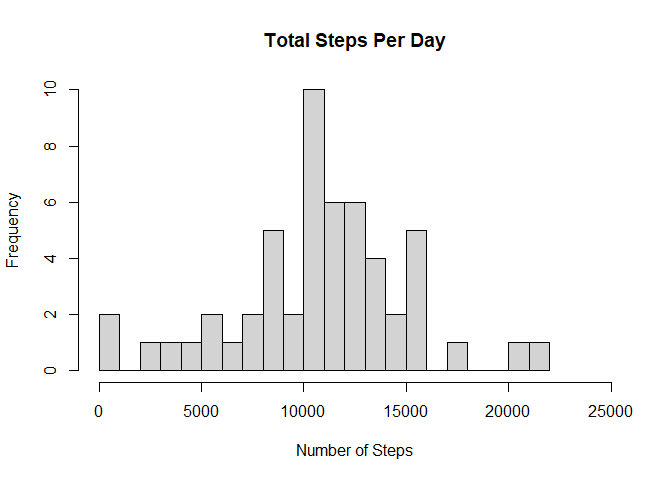
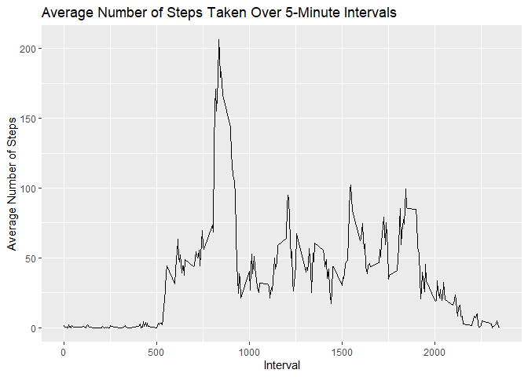
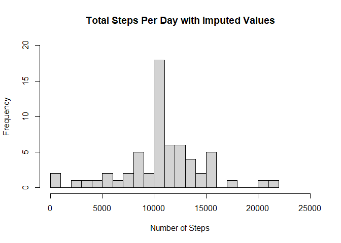
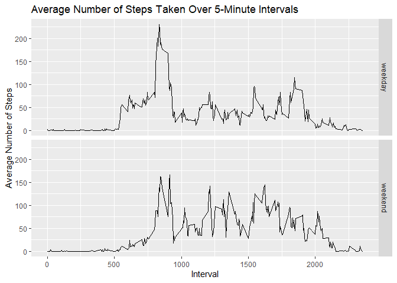

## Loading and preprocessing the data

Load the data (i.e. read.csv())

Process/transform the data (if necessary) into a format suitable for your analysis

Load in potential libraries

```r
library(dplyr)
library(ggplot2)
```


Unzip file and read in csv file

```r
activity <- read.csv(unz('activity.zip', "activity.csv"))
```

Look at structure of activity

```r
str(activity)
```

```
## 'data.frame':	17568 obs. of  3 variables:
##  $ steps   : int  NA NA NA NA NA NA NA NA NA NA ...
##  $ date    : chr  "2012-10-01" "2012-10-01" "2012-10-01" "2012-10-01" ...
##  $ interval: int  0 5 10 15 20 25 30 35 40 45 ...
```

Edit class of date

```r
activity$date <- as.Date(activity$date,"%Y-%m-%d")
class(activity$date)
```

```
## [1] "Date"
```


## What is mean total number of steps taken per day?

For this part of the assignment, you can ignore the missing values in the dataset.

    Make a histogram of the total number of steps taken each day

    Calculate and report the mean and median total number of steps taken per day


```r
#Calculate total number of steps each day
steptotals <-aggregate(steps ~ date, data=activity, FUN=sum, na.action=na.omit)
```

Create histogram of total number of steps taken each day


<!-- -->

Calculate mean and median:  

    The mean of the total number of steps taken per day is 10766.

    The median of the total number of steps taken per day is 10765.


## What is the average daily activity pattern?
Make a time series plot (i.e. type = "l" of the 5-minute interval (x-axis) and the average number of steps taken, averaged across all days (y-axis)


<!-- -->

Which 5-minute interval, on average across all the days in the dataset, contains the maximum number of steps?


    The interval with max steps is interval 835 with 206 average steps.
    

## Imputing missing values
Note that there are a number of days/intervals where there are missing values (coded as NA). The presence of missing days may introduce bias into some calculations or summaries of the data.

Calculate and report the total number of missing values in the dataset (i.e. the total number of rows with NAs)

    There are 2304 missing values.


Devise a strategy for filling in all of the missing values in the dataset. The strategy does not need to be sophisticated. For example, you could use the mean/median for that day, or the mean for that 5-minute interval, etc.

    To fill in missing values, I will replace the missing values with the mean for that 5-minute interval.

Create a new dataset that is equal to the original dataset but with the missing data filled in.

```r
activity_noNA <- as.data.frame(activity %>%
  group_by(interval) %>%
  mutate(steps = replace(steps,is.na(steps),mean(steps,na.rm=TRUE))))
```

Make a histogram of the total number of steps taken each day and Calculate and report the mean and median total number of steps taken per day. Do these values differ from the estimates from the first part of the assignment? What is the impact of imputing missing data on the estimates of the total daily number of steps?


```r
# Calculate updated total number of steps each day
newsteptotals <-aggregate(steps ~ date, data=activity_noNA, FUN=sum)
```

Create histogram of total number of steps taken each day


<!-- -->

Calculate mean and median:  

    The new mean of the total number of steps taken per day is 10766.

    The new median of the total number of steps taken per day is 10766.
    
    After imputing the values, the median increased slightly.  Since the missing values were replaced with means for the interval, the median of total steps per day moved closer to the mean.


## Are there differences in activity patterns between weekdays and weekends?

Create a new factor variable in the dataset with two levels -- "weekday" and "weekend" indicating whether a given date is a weekday or weekend day.


```r
activity_noNA <- activity_noNA %>%
  mutate(weekdays = weekdays(date)) %>%
  mutate(weekdayweekend = ifelse((weekdays=="Saturday" | weekdays=="Sunday"), "weekend", "weekday"))

#verify that Saturday and Sunday are classified as weekend, other days are weekday
table(activity_noNA$weekdays,activity_noNA$weekdayweekend)
```

```
##            
##             weekday weekend
##   Friday       2592       0
##   Monday       2592       0
##   Saturday        0    2304
##   Sunday          0    2304
##   Thursday     2592       0
##   Tuesday      2592       0
##   Wednesday    2592       0
```

Make a panel plot containing a time series plot (i.e. type = "l") of the 5-minute interval (x-axis) and the average number of steps taken, averaged across all weekday days or weekend days (y-axis). 
    


```r
# Calculate average steps for intervals across weekdays and weekends
newintervalaverages <- aggregate(steps ~ interval + weekdayweekend, data=activity_noNA, FUN=mean)
```

Generate plot for intervals across weekdays and weekends

```r
p2 <- ggplot(newintervalaverages, aes(x=interval,y=steps))
p2 + geom_line() + facet_grid(rows=vars(weekdayweekend)) + 
  labs(x="Interval", y="Average Number of Steps", 
       title="Average Number of Steps Taken Over 5-Minute Intervals")
```

<!-- -->

The plot shows that there are some differences between weekday in average number of steps. The peak number of steps occur around the same time for both weekdays and weekends, but the peak is higher on weekdays.  After the peak on the weekdays, the average number of steps drops greatly.  On weekends, there is a smaller drop after the peak.  After the peak, there appears to be more activity  on the weekends compared to the weekdays.


